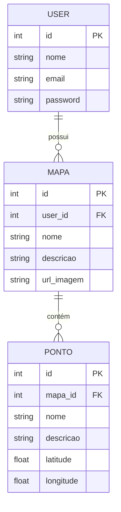
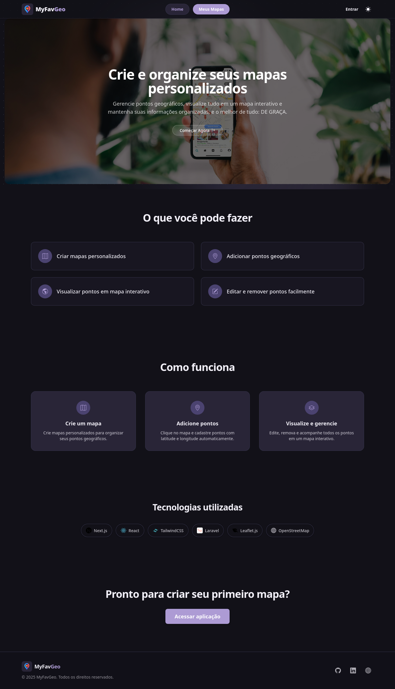
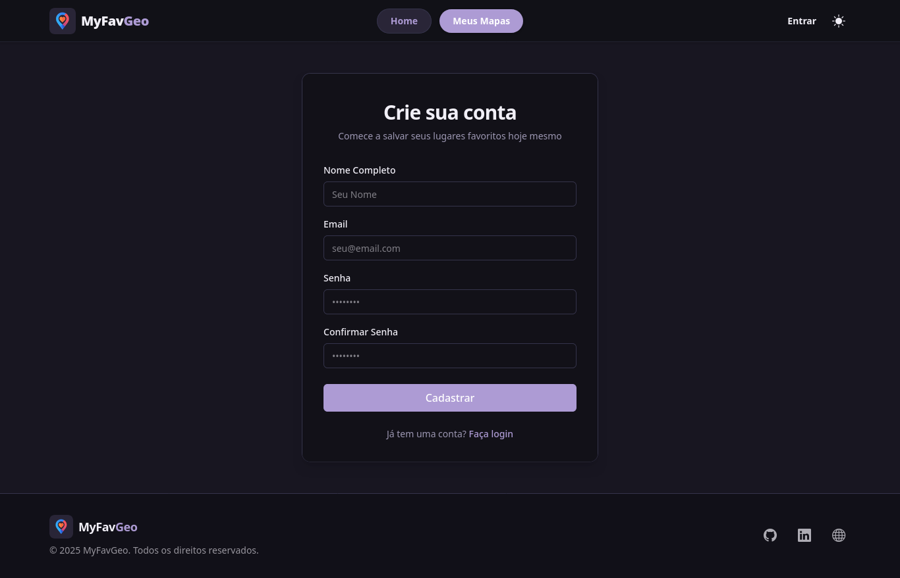
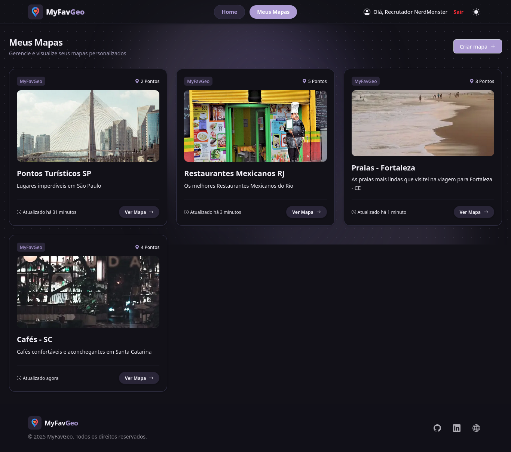
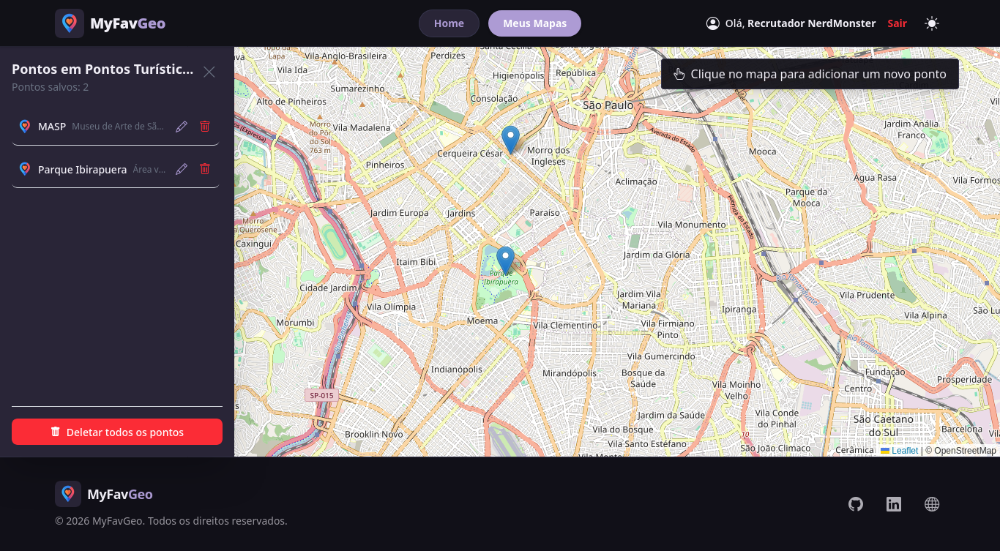

# 🗺️ MyFavGeo - Desafio NerdMonster


> **"Mais do que um simples teste, um projeto feito com cuidado, aprendizado e propósito."**

Bem-vindo ao **MyFavGeo**, uma aplicação Full Stack desenvolvida como solução para o desafio técnico da NerdMonster. Este sistema permite que usuários criem seus próprios mapas personalizados e adicionem pontos de interesse geolocalizados de forma interativa, indo além de uma solução.

---

## 🎯 O que este projeto demonstra

- Capacidade de estruturar uma aplicação Full Stack do zero com base em experiências anteriores e reais
- Boas práticas de arquitetura e separação de responsabilidades
- Preocupação com segurança (JWT + HttpOnly Cookies)
- Comunicação clara via documentação (Swagger + README)

---

## 🚀 Quick Start (Como Rodar)

O projeto foi totalmente dockerizado para garantir que você não tenha "dores de cabeça" com configurações de ambiente.

### Pré-requisitos

- Docker e Docker Compose instalados.

Caso não tenha o Docker instalado:

> - Documentação oficial: https://docs.docker.com/get-docker/
> - ou Instalação rápida no Linux:
>
> ```bash
> curl -fsSL https://get.docker.com | sh
> sudo usermod -aG docker $USER
> ```
>
> Após isso, reinicie a sessão para aplicar as permissões.

### Passo a Passo

1. Clone o repositório e entre na pasta:

```bash
git clone https://github.com/tluccas/myfavgeo-app/
cd MyFavGeo-App
```

2. Suba o ambiente com um único comando:

```bash
## Opção 1: Para rodar com terminal livre
docker-compose up -d --build

## Opção 2: Para acompanhar todo o processo com os logs
docker-compose up --build
```

3. Aguarde alguns instantes para os containers iniciarem e o banco de dados ser populado.

---

## 🔑 Acesso e Credenciais

Para facilitar a sua avaliação, o sistema já inicia com um usuário de teste e dados de exemplo pré-carregados :).

| Serviço      | URL                                                            | Descrição               |
| ------------ | -------------------------------------------------------------- | ----------------------- |
| **Frontend** | [http://localhost:3000](http://localhost:3000)                 | Aplicação Web (Next.js) |
| **API Docs** | [http://localhost:8000/api/doc](http://localhost:8000/api/doc) | Swagger / OpenApi       |
| **Backend**  | [http://localhost:8000](http://localhost:8000)                 | API Laravel             |

### 👤 Usuário de Teste

- **E-mail:** `admin@admin.com`
- **Senha:** `123456`

> [!WARNING]
> > **Nota Importante sobre Persistência:**
> Para garantir um ambiente de teste limpo e previsível para o avaliador, configurei o container do Backend para rodar as _migrations_ e _seeders_ **toda vez que é iniciado**.
> Isso significa que se você reiniciar o container (`docker-compose restart` ou `down/up`), o banco voltará ao estado original com o usuário acima e os dados de exemplo. Dados criados manualmente na sessão anterior serão resetados.

---

## 🛠️ Stack Tecnológica e Decisões
[](./myfavgeo-backend/README.md)
[](./myfavgeo-frontend/README.md)
### Backend (Laravel 11 + PHP 8.3)

Optei por uma arquitetura pensando em uma aplicação real com base em minhas experiências, indo além do básico:

- **Arquitetura em Camadas (MVC):** Uso de **Services** para regras de negócio e **DTOs (Data Transfer Objects)** para tráfego de dados, mantendo os Controllers magros.
- **Autenticação Segura:** Implementação de **JWT** com armazenamento seguro via **HttpOnly Cookies**, protegendo contra ataques XSS.
- **Documentação:** API totalmente documentada com **Swagger/OpenAPI**.
- **Padronização:** Uso de Form Requests para validação e Resources para transformação de respostas JSON.

### Frontend (Next.js 14 + React)

Uma interface moderna e responsiva:

- **App Router:** Utilizando as funcionalidades mais recentes do Next.js.
- **Mapas Interativos:** Integração com **Leaflet** e OpenStreetMap como sugerido.
- **UI/UX:** Design responsivo (Mobile First) estilizado com **Tailwind CSS**.
- **Feedback Visual:** Modais, Loadings e tratamento de erros amigável.

### Estrutura de Dados e Relacionamentos (MySQL/MariaDB)

A arquitetura do banco de dados segue um modelo relacional, onde o usuário é o proprietário dos mapas e cada mapa agrupa diversos pontos geográficos.

- **Usuários** `users`: Relacionamento -> Possui muitos (`HasMany`) _**Mapas**_. | **Segurança:** A senha é criptografada via Mutator (`bcrypt`)
- **Mapas** `mapas`: Relacionamento -> Pertence a (`BelongsTo`) um **_Usuário_** e possui muitos (`HasMany`) **_Pontos_**. | **Funcionalidade:** Inclui lógica para formatação automática de nomes e tratamento de URLs de imagem.
- **Pontos** `pontos`: Relacionamento -> Pertence a (`BelongsTo`) um _Mapa_. | **Atributos:** Armazena `latitude` e `longitude` como _floats_ para precisão de geolocalização.



### Infraestrutura (Docker)

- **Healthchecks:** Configuração de `healthcheck` no MySQL para evitar "race conditions" na inicialização da API.
- **Isolamento:** Frontend, Backend e Banco de dados totalmente isolados em containers.
- **Porta Segura:** O banco de dados expõe a porta `3307` para o host para evitar conflitos com MySQL locais na porta padrão `3306`.

### ✅ Qualidade e Testes Automatizados

A qualidade do código foi garantida através de **Feature Tests** automatizados no Backend, cobrindo os fluxos críticos da aplicação e garantindo que as regras de negócio e segurança estejam funcionando conforme o esperado.

**O que foi testado:**

- **Fluxo de Mapas:** Criação, validação e persistência.
- **Fluxo de Usuários:** Registro e validação de unicidade de e-mail.
- **Segurança (IDOR):** Testes de regressão garantindo que um usuário **não consiga** adicionar pontos no mapa de outro usuário.

**Como rodar os testes:**
Com o ambiente Docker rodando, execute:

```bash
docker-compose exec backend php artisan test
```

> [!NOTE] 
> Os testes rodam em um banco de dados **SQLite em memória**, garantindo isolamento dos dados.

---

## 🧪 Funcionalidades Entregues

- [x] **Autenticação:** Login e Registro de usuários.
- [x] **Gestão de Mapas:** Criar, Listar, Visualizar e Excluir mapas.
- [x] **Gestão de Pontos:** Adicionar pontos clicando no mapa, remover pontos.
- [x] **Visualização:** Lista de pontos integrada com o mapa interativo.
- [x] **Responsividade:** Layout adaptado para Desktop e Mobile.
- [x] **API Documentada:** Swagger acessível em `/api/doc`.

---

## 📂 Estrutura do Projeto

```
MyFavGeo-App/
├── docker-compose.yml      # Orquestração dos containers
├── myfavgeo-backend/       # API Laravel
│   ├── app/
│   │   ├── DTOs/           # Objetos de Transferência de Dados
│   │   ├── Services/       # Regras de Negócio
│   │   └── Http/           # Controllers, Middlewares e Resources
│   └── ...
└── myfavgeo-frontend/      # Aplicação Next.js
    ├── app/                # Páginas e Rotas (App Router)
    ├── components/         # Componentes Reutilizáveis
    └── lib/                # Configurações de API e Utils
```

---

## 🖼️ Preview da Aplicação

 
 |  |

Feito com 💜 e muito café por [Lucas Alves](https://www.linkedin.com/in/lucasalvesz/).
Espero que gostem do resultado! :) 🚀

